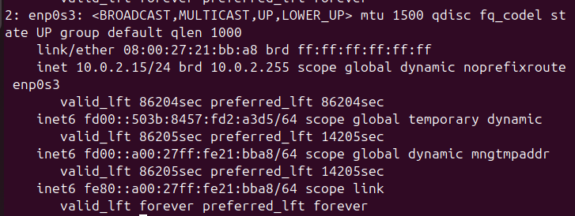
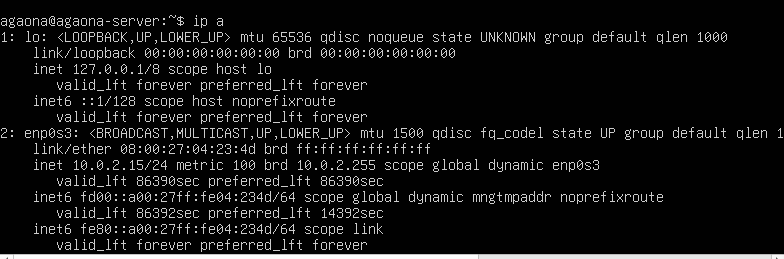
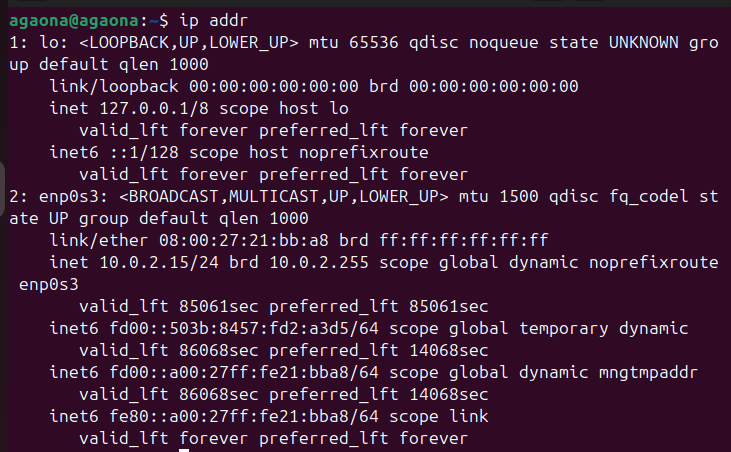
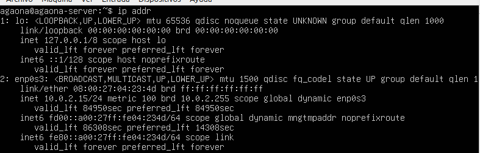
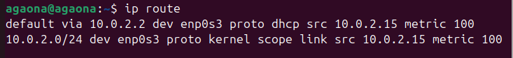
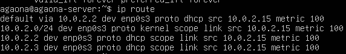
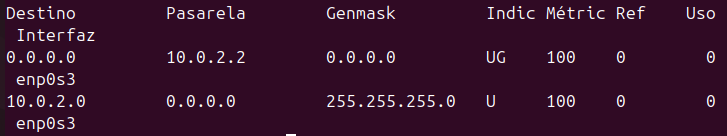

# UD5-P1. Conexiones de redes y gestión de recursos en Linux

## Escenario

Se simula una pequeña red local formada por dos equipos Linux que deben comunicarse entre sí y permitir la administración remota de un servidor.

La práctica se realizará utilizando:

    Ubuntu Server 24 (servidor)
    Ubuntu Desktop 24 (cliente)

Aunque el cliente dispone de entorno gráfico, todas las tareas deberán realizarse desde terminal.

El objetivo es aprender a configurar la red, verificar la conectividad, analizar el funcionamiento de la red y gestionar recursos accesibles a través de ella.
Infraestructura

Máquina 1 — servidor
sistema: Ubuntu Server 24
hostname: srv01
rol: servidor accesible por red y por SSH

Máquina 2 — cliente
sistema: Ubuntu Desktop 24
hostname: cli01
rol: equipo desde el que se realizan pruebas de conectividad y acceso remoto
Configuración de red

Ambas máquinas estarán conectadas a la misma red local.

Red:

192.168.50.0/24

Direcciones IP:

srv01 → 192.168.50.10
cli01 → 192.168.50.20

## E1. Identificación de interfaces de red

**En cada máquina, muestra las interfaces de red disponibles ejecutando:**

```bash
ip a
```
Cliente:



Servidor:



**Responde:**
- ¿Que interfaz de red está activa?

  La interfaz activa es enp0s3, ya que es la que tiene la conexión a la red.

- ¿Qué dirección IP tiene asignada actualmente?

  En la maquina cliente tiene la dirección IP: 
  10.0.2.15/24

  En la maquina servidor tiene la dirección IP: 
  10.0.2.15/24

- ¿Qué dirección MAC tiene la interfaz?

  Cliente: 08:00:27:21:bb:a8 brd ff:ff:ff:ff:ff:ff

  Servidor: 08:00:27:04:23:4d brd ff:ff:ff:ff:ff:ff

- ¿A qué red pertenece la dirección IP?

  Ambas pertencen a la red 10.0.2.0/24

### Explicación
El comando ip a permite mostrar todas las interfaces de red del sistema, incluyendo su estado, dirección IP y dirección MAC.
En la salida se puede observar la interfaz activa identificada con el estado UP, su dirección IP en formato inet y su dirección física MAC en la línea link/ether

### Documentación consultada
> He consultado la documentación usando únicamente el manual del comando ip en Ubuntu, con el comando:
```bash
man ip
```

## E2. Identificación de la configuración de red

**Muestra nuevamente la configuración IP:**
```bash
ip addr
```
Cliente:



Servidor:




**Muestra la tabla de rutas del sistema:**
```bash
ip route
```
Cliente:



Servidor:



**Responde:**

- ¿Qué red local aparece configurada?

  Ambas aparecen con la red local: 10.0.2.0/24

- ¿Qué interfaz se utiliza para acceder a esa red?

  enp0s3

- ¿Existe una puerta de enlace configurada?

  Si existe una.

  

### Documentación consultada

https://man7.org/linux/man-pages/man8/ip-route.8.html

### Explicación

La puerta de enlace 10.0.2.2 es tu puente hacia el mundo exterior. Es el dispositivo al que tu equipo le entrega todo el tráfico destinado a Internet porque, por sí solo, no sabe cómo salir de tu red local. Sin esta dirección, estarías aislado y solo podrías comunicarte con los equipos que tienes justo al lado.

## E3. Configuración del nombre de host

**Consulta el nombre actual del sistema ejecutando:**
```bash
hostname
```
Cliente:


Servidor:


**Configura el nombre correspondiente.**

Servidor:
```bash
sudo hostnamectl set-hostname srv01
```

Cliente:
```bash
sudo hostnamectl set-hostname cli01
```


**Comprueba el cambio ejecutando:**
```bash
hostname
```
Cliente:


Servidor:


### Explicación comando "hostname"

El comando hostname es básicamente el carné de identidad de tu equipo en la red. Sirve para consultar o cambiar el nombre que identifica a tu sistema y su dominio, permitiendo que otros dispositivos sepan exactamente quién eres. Es la herramienta principal para gestionar tu nombre de máquina y asegurar que tu equipo sea reconocible dentro de cualquier red local o de internet.

### Documenatción consultada

https://man7.org/linux/man-pages/man1/hostname.1.html


## E4. Configuración de dirección IP estática
**Edita el archivo de configuración de red:**
```bash
sudo nano /etc/netplan/01-netcfg.yaml
```

Cliente:


Servidor:


**Aplica la configuración:**
```bash
sudo netplan apply
```
Cliente:


Servidor:


**Comprueba la configuración:**
```bash
ip a
```
Cliente:


Servidor:


### Configuración de red con Netplan (IP estática)

```yaml
network:
  version: 2
  renderer: networkd

  ethernets:
    enp0s3:
      addresses:
        - 192.168.50.20/24

      routes:
        - to: default
          via: 192.168.50.1

      nameservers:
        addresses:
          - 8.8.8.8
```

### Explicación de cada parte

- **network:** Indica el inicio de la configuración de red.

- **version: 2**  
Define la versión del formato de configuración de Netplan.

- **renderer: networkd**  
Indica el servicio que gestiona la red.  
- `networkd` → Usado normalmente en servidores.  
- `NetworkManager` → Usado en sistemas con entorno gráfico.

- **ethernets:**  
Define las interfaces de red cableadas.

- **enp0s3:**  
Nombre de la interfaz de red configurada.

- **addresses:**  
Permite asignar una dirección IP manual.

- **192.168.50.20/24**  
Dirección IP estática con máscara de red `/24`.

- **routes:**  
Define la puerta de enlace (gateway).

- **to: default**  
Indica la ruta por defecto.

- **via: 192.168.50.1**  
Dirección IP del gateway o router.

- **nameservers:**  
Define los servidores DNS.

- **8.8.8.8**  
Servidor DNS público de Google.


### Documentación oficial consultada

- **Manual de Ubuntu:**
https://ubuntu.com/server/docs/explanation/networking/configuring-networks/#configuring-networks

## E5. Verificación de conectividad entre máquinas
**Desde el cliente ejecuta:**
```bash
ping 192.168.50.10
```


**Desde el servidor ejecuta:**
```bash
ping 192.168.50.20
```


**Responde:**
- ¿Se reciben respuestas del otro equipo?

    Sí, se reciben respuestas correctamente, lo que indica que existe conectividad entre ambas máquinas.

- ¿Cuántos paquetes se envían y reciben?

    Se envían 4 paquetes y se reciben 4.

- ¿Qué información muestra el comando ping?
    
    Dirección IP de destino.
    Tiempo de respuesta (time=) en milisegundos.
    Número de secuencia (icmp_seq).
    Tiempo total (ttl).
    Estadísticas finales de paquetes enviados y recibidos.

### Documentación consultada
**Página oficial man (Linux):**

https://man7.org/linux/man-pages/man8/ping.8.html

## E6. Configuración de resolución de nombres local

**Edita el archivo:**
```bash
sudo nano /etc/hosts
```
**Añade las entradas:**
```bash
192.168.50.10 srv01
192.168.50.20 cli01
```
Cliente:


Servidor:


**Comprueba la resolución de nombres:**
```bash
ping srv01
```


```bash
ping cli01
```


### Explicación resolucion nombres (/etc/hosts)

El archivo /etc/hosts permite asociar nombres de host con direcciones IP sin utilizar un servidor DNS.
Cuando se escribe un nombre como srv01, el sistema consulta este archivo para obtener la dirección IP correspondiente.

### Documentación consultada

https://man7.org/linux/man-pages/man5/hosts.5.html

## E7. Análasis de rutas de red

**Muestra la tabla de rutas del sistema:**
```bash
ip route
```
Cliente:


Servidor:


**Responde:**

- ¿Qué red aparece en la tabla de rutas?

  192.168.50.0/24

- ¿Qué interfaz se utiliza para acceder a esa red?

  dev enp0s3

- ¿Qué significa cada columna mostrada en la tabla?

  destination → red destino
  dev → interfaz utilizada
  proto → tipo de ruta
  scope → alcance de la ruta

### Documentación consultada
https://man7.org/linux/man-pages/man8/ip-route.8.html


### E8. Identificación de puertos y servicios activos

**Muestra los puertos abiertos en el sistema:**
```bash
ss -tuln
```
Cliente:


Servidor:


**Responde:**

- ¿Qué puertos aparecen abiertos?

  Cliente: 
  Puerto 53 DNS / Puerto 5353 mDNS / Puerto 631 IPP / Puertos UDP 51661 y 46714 

  Servidor:
  Puerto 53 DNS / Puerto 22 SSH 

- ¿Qué significa cada columna mostrada en la salida del comando?

  Netid → protocolo (TCP o UDP)
  State → estado del puerto
  Local Address → IP local
  Port → puerto utilizado

- ¿Qué protocolos se están utilizando?

  TCP y UDP

### Documentación consultada
https://man7.org/linux/man-pages/man8/ss.8.html


## E9. Instalación y configuración del servicio SSH

**En el servidor ejecuta:**
```bash
sudo apt update
sudo apt install openssh-server
```


**Comprueba el estado del servicio:**
```bash
sudo systemctl status ssh
```


**Comprueba que el puerto está abierto:***
```bash
ss -tuln
```


### Explicación servicio instalado

El servicio SSH permite administrar un sistema de forma remota mediante conexión segura.

El puerto utilizado por defecto es:
```bash
22
```
### Documentación consultada

https://man7.org/linux/man-pages/man1/ssh.1.html


## E10. Acceso remoto al servidor

**Desde cli01, establece una conexión SSH con el servidor:**
```bash
ssh usuario@192.168.50.10
```


**Una vez conectado ejecuta:**
```bash
whoami
hostname
```


### Explicación
- ¿Qué usuario está conectado?
  
  El usuario mostrado por whoami.

- ¿En qué máquina se ejecutan los comandos?
  En el servidor remoto, identificado con hostname.

### Documentación consultada

https://man7.org/linux/man-pages/man1/ssh.1.html


## E11. Análisis del estado de las interfaces

**Muestra el estado de las interfaces ejecutando:**
```bash
ip link
```
Cliente:


Servidor:


**Responde:**

- ¿Qué interfaces aparecen en el sistema?
  
  lo → loopback

  enp0s3 → red principal

- ¿Qué estado tiene cada una (UP, DOWN)?

  UP → activa

  DOWN → inactiva

### Documentación consultada

https://man7.org/linux/man-pages/man8/ip-link.8.html


## E12. Consulta de la tabla ARP

**Muestra las entradas de la tabla ARP ejecutando:**
```bash
ip neigh
```
Cliente:


Servidor:


**Responde:**

- ¿Qué dirección IP aparece asociada a la otra máquina?

  Cliente: Aparece la del server = 192.168.50.10

  Servidor: Aparece la del cliente = 192.168.50.20

- ¿Qué dirección MAC tiene?

  Cliente: MAC server = 08:00:27:62:22:d6

  Servidor: MAC cliente = 08:00:27:27:52:75

### Explicación entre relación IP y direccion MAC
IP → dirección lógica
MAC → dirección física

### Documentación consutlada

https://man7.org/linux/man-pages/man8/ip-neighbour.8.html


## E13. Transferencia de archivos entre máquinas

**Desde el cliente crea un archivo:**
```bash
nano prueba.txt
```


**Copia el archivo al servidor utilizando:**
```bash
scp prueba.txt usuario@192.168.50.10:/home/usuario
```


**Comprueba en el servidor que el archivo se ha copiado correctamente.**


### Explicación funcion scp

El comando scp permite copiar archivos entre equipos mediante SSH de forma segura.

### Documentación consultada
https://man7.org/linux/man-pages/man1/scp.1.html


## E14. Gestión del servicio SSH

**En el servidor ejecuta:**
```bash
sudo systemctl stop ssh
```


> NOTA: He tenido que ejecutar el siguiente comando para pararlo completamente:
```bash
sudo systemctl stop ssh.socket
```

**Comprueba si el puerto sigue abierto:**
```bash
ss -tuln
```


**Intenta conectarte desde el cliente.**


**Después vuelve a iniciar el servicio:**
```bash
sudo systemctl start ssh
```


**Vuelve a aparecer en ss -tuln:**


**Se puede conectar desde el cliente:**


### Explicación

Cuando el servicio SSH se detiene:

el puerto 22 deja de estar disponible
no es posible conectarse remotamente

Cuando se inicia nuevamente:

el puerto vuelve a abrirse
las conexiones SSH funcionan

### Documentación consultada

https://www.cyberciti.biz/faq/howto-start-stop-ssh-server/

## E15. Reinicio y comprobación de persistencia

**Reinicia ambas máquinas.**

  **Comprueba que:**

  la dirección IP sigue configurada correctamente
  el hostname se mantiene
  el servicio SSH se inicia automáticamente
  Utiliza los comandos necesarios para verificar cada elemento.

Cliente:


Servidor:


### Explicación
La configuración se mantiene tras reiniciar porque:

Netplan guarda la configuración de red.

Hostname se guarda en archivos del sistema.

SSH está habilitado para iniciar automáticamente.


### Documentación consultada

Netplan: https://netplan.readthedocs.io/en/latest/netplan-yaml/


Hostname: https://man7.org/linux/man-pages/man1/hostname.1.html

SSH: https://man7.org/linux/man-pages/man1/systemctl.1.html
